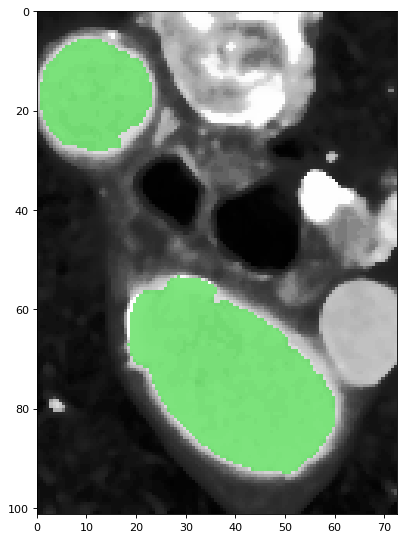

.. AortaGeomRecon documentation master file, created by
   sphinx-quickstart on Wed Feb  8 12:25:31 2023.
   You can adapt this file completely to your liking, but it should at least
   contain the root `toctree` directive.

Welcome to AortaGeomRecon's design document!
============================================

This is the design document for the AortaGeomRecon module, a :term:`3D Slicer` extension to perform :term:`Aorta` segmentation and Aorta geometry reconstruction. 

You can find the source code, the installation guide, and the user manual in the project's `repository <https://github.com/smiths/aorta>`_.

Overview
********
Automatic aorta segmentation in thoracic computed tomography (CT) scans is important for aortic calcification quantification and to guide the segmentation of other central vessels. The work to manually segment regions of interest can be time-consuming and repetitive, and there are some automatic aorta segmentation algorithms posted. This project implemented a semi-automatic algorithm that can extract the 3-dimensional segmentation of the aorta. 

------------

The steps before applying the main algorithm
********************************************

The algorithm works best with the chest volume cropped to a rectangular prism that contains the aorta and parts of the other organs such as the backbone, blood vessels, and the heart. This can be done with :term:`3D Slicer` and its submodule `Volume rendering <https://slicer.readthedocs.io/en/latest/user_guide/modules/volumerendering.html>`_. A detailed guide can be found on the `volume rendering and cropping section <https://github.com/smiths/aorta#to-use-volume-rendering-to-crop-a-voi>`_ of the user instructions. 

After cropping the volume, which only contains the region of interest, the algorithm needs a set of variables inputs from the user. These variables are:

1. The centre coordinates of :term:`Descending Aorta` and :term:`Ascending Aorta` located on the same :term:`slice` (a voxel).

.. figure:: Aorta_seeds.png
   :align: center
   :alt: Aorta seeds

2. The :term:`Stop limit`.
3. The :term:`threshold coefficient`.
4. An integer for :term:`kernel size`.
5. The ThresholdSegmentationLevelSetsImageFilter parameters, including:
    a. The :term:`rms_error` (float)
    b. The :term:`Maximum iteration` (int)
    c. The :term:`Curvature scaling` (float)
    d. The :term:`Propagation scaling` (float)

The main ideas of the algorithm
*******************************

At the beginning of the algorithm, the user inputs two integer coordinates indicating the position of the descending aorta and ascending aorta centre on a single :term:`slice`. This algorithm segments each :term:`slice` with `SITK\:\:ThresholdSegmentationLevelSetImageFilter <https://simpleitk.org/doxygen/latest/html/classitk_1_1simple_1_1ThresholdSegmentationLevelSetImageFilter.html>`_. The principles of this image filter can be explained with two terms: :term:`Level sets` segmentation method, and a :term:`threshold` range that defines the intensity of the acceptable pixel. The following steps elaborate on how the algorithm calculated the necessary values to perform segmentation.

For each slice starting from the user's selected slice, going in the :term:`inferior` first, then :term:`superior` direction:

1. **[Create a label map]**
The algorithm uses `SITK\:\:BinaryDilateImageFilter <https://simpleitk.org/doxygen/latest/html/classitk_1_1simple_1_1BinaryDilateImageFilter.html>`_ to perform :term:`binary dilation` to generate a circle-like shape around the centre coordinates (user input's or calculated by the algorithm). Each pixel within this shape will be labeled as a white pixel (value of 1), and the rest of the pixels are labeled as black pixels (value of 0). The generated result is the :term:`label map` image, and we will use it in the next few steps. The size of the circle-like shape is determined by the :term:`kernel size`.

.. figure:: label_image.png
   :align: center
   :alt: label image

   The green circles shows the binary dilation of the two centroids.

2. **[Create a distance map]**
With `SITK\:\:SignedMaurerDistanceMapImageFilter <https://simpleitk.org/doxygen/latest/html/classitk_1_1simple_1_1SignedMaurerDistanceMapImageFilter.html>`_, the algorithm creates another image, the :term:`Euclidean distance transform` of the label image. This is used as a :term:`contour line` that helps build the gradient mentioned in :term:`Level sets`.

3. **[Calculate a threshold range]**
By using `SITK\:\:LabelStatisticsImageFilter <https://simpleitk.org/doxygen/latest/html/classitk_1_1simple_1_1LabelStatisticsImageFilter.html>`_, the algorithm gets the mean and the standard deviation of the intensity values of the pixels that were labeled as the white pixel in the previous step. The algorithm uses :term:`threshold coefficient` to calculate the lower and upper :term:`threshold` to be used in the next step.

4. **[Segment a single slice]**
With `SITK\:\:ThresholdSegmentationLevelSetImageFilter <https://simpleitk.org/doxygen/latest/html/classitk_1_1simple_1_1ThresholdSegmentationLevelSetImageFilter.html>`_,  the seed image calculated in step 2, and the lower and upper threshold value calculated in step 3, the algorithm performs segmentation and generated a :term:`segmented slice`.

   The green pixels are labeled as part of the aorta.

5. **[Calculate new centroids]**
By comparing each pixel segmented as aorta to the previous descending centroid and the previous ascending centroid, the algorithm use the positions of the points closer to the previous descending centroid to calculate new descending aorta centroid, and vice-versa for the ascending aorta centroid. However, at certain point during the segmentation in inferior direciton, the slice might reaches the end of the ascending aorta, where the voxels belong to the part of the heart. The algorithm will stop using ascending aorta centroid and only computes descending aorta centroid for the slices afterward.

6. **[Verify segmentation result]**
There are two main stop conditions for verifying segmentation result, one condition for the segmentation in inferior direction and the other one for the segmentation in superior direction. :term:`Stop limit` is an user defined parameter to control the algorithm.

    .. note::
       For the segmentaion in inferior direction, the segmented slice is determined as not acceptable if part of the heart is segmented as the ascending aorta. Thus, the stop condition for the segmentation in inferior direction is to verify if the new ascending aorta centroid position is located far from the previous ascending aorta centroid. :term:`Stop limit` is used to define the distance limit.

       For the segmentation in superior direction, the algorithm mainly works on the aortic curvature, where the area of the aorta becomes smaller as the algorithm executes on further slices. The standard deviation of the label image and of the segmented slice will be used to compare. The algorithm stop processing next slice if the difference between these two standard deviation reaches the :term:`Stop limit`.

The simplified version of the algorithm
***************************************
.. figure:: program_flowchart.png
   :align: center
   :alt: Program flowchart
   
.. note::

   You can find the definitions of each function within the module below

.. toctree::
   :maxdepth: 2
   :caption: Modules documentation:

   modules

Indices and tables
******************

| :ref:`genindex`
| :ref:`modindex`

.. toctree::
   :maxdepth: 1
   
   Glossary <glossary>
